GINtool manual

Version: September 3^de^ 2022

**Contents**

1\. Introduction to the tool 2

2\. Installation of GINtool 2

3\. Overview of the tool 2

4\. Preparing GINtool for analyses 6

5\. Analysis of operons 8

6\. Analysis of regulons 10

7\. Analysis of functional categories 21

8\. Overview of output sheets 33

9\. Other ways to use GINtool data 35

10\. Calculations of MAD & p values 35

**1. Introduction to the tool**

GINtool is an Excel plugin that is used for a comprehensive analysis of
transcriptome data based on information on operons, regulons and
functional categories.

This manual describes how to use GINtool. For each type of analysis,
examples are shown.

**2. Installation of GINtool**

[2.1. Preparation]{.underline}

Before installing GINtool, close Excel.

[2.2. Installation]{.underline}

Click setup.exe to install GINtool.

> When clicking on setup.exe the following error message might appear:
> "*Customized functionality in this application will not work because
> the certificate used to sign the deployment manifest for GINtool or
> its location is not trusted. Contact your administrator for further
> assistance.*"
>
> In this case do the following:
>
> 1\) Right click on setup.exe;
>
> 2\) Select properties then the Digital Signatures tab;
>
> 3\) Select "XXXX\\YYYY" then click Details;
>
> 4\) Click View Certificate and Click Install Certificate, go to
> Current user then Details and choose "Place all certificates in the
> following store";
>
> 5\) Browse and select "Trusted Root Certification Authorities Store".
> Finally, finish and close the windows;
>
> 6\) Click setup.exe again to install GINtool.

**3. Overview of the tool**

[3.1 GINtool interface]{.underline}

GINtool is an Excel plugin that is added as a tab to the Excel toolbar
after installation (see section 2). Figure 1 shows an overview of the
tool. After clicking on the GINtool tab (Figure 1A, red box), the
analysis bar appears (Figure 1B). From here you can move to the settings
(main), select your data (select), activate filters (filter settings),
choose the focus of your analysis (focus), create tables (tables),
create plots (plots) and find this manual (help).

Via "[show/hide settings]{.underline}" (Figure 1B, main) the settings
bar appears (Figure 1C). The reference files on gene info, operons,
regulons, categories and regulon info can be uploaded (reference files),
cut-offs can be determined (cut-offs) and sorting directions of the
results can be chosen (sort direction). The columns of the reference
files (see section 3.2) are linked to the tool by clicking on the
reference file buttons and selecting the appropriate column names
(column mapping, *e.g.*, for regulons in Figure 1D, see section 4.1).

{width="6.160416666666666in"
height="4.513888888888889in"}

Figure 1: Overview of the GINtool plug-in. A) Location of GINtool tab in
toolbar; B) Analysis bar; C) Settings bar; D) Regulon column mapping.

[3.2 Overview of input reference files]{.underline}

GINtool works with 5 different information files: (i) A file containing
information on the function of genes ("[gene info]{.underline}"), (ii) A
file indicating how genes are located in operons
("[operons]{.underline}"), (iii) A file indicating to which regulon the
gene belongs ("[regulons]{.underline}"), (iv) A file indicating to which
functional category the gene belongs ("[categories]{.underline}"), and
(v) A file containing information on the function of regulons ("[regulon
info]{.underline}"). These files can be imported either as txt files
(\*.csv) or Excel files (\*.xlsx). The genes are linked to the
information by either gene name or unique identifiers (ID).

The files shown in the examples are based on information obtained from
*Subtiwiki*, a database for the model bacterium *Bacillus subtilis*.
Figure 2 shows an overview of the different (.csv) reference files. Each
reference file starts with a header for each of the columns in the file.

-   The gene info reference file contains four columns: locus_tag, gene,
    function and description (Figure 2A). The gene ID, the gene name,
    gene function, and functional description are separated by commas.

-   The operon reference file contains one column: genes (Figure 2B).
    The operons are indicated as a list of gene names that are connected
    (e.g., yokI-yokJ-yokK-yokL). Single locus genes are indicated by
    single gene names (e.g., ywqG).

-   The regulator reference file contains five columns: regulator locus,
    regulator name, mode (type of regulation), gene locus and gene name,
    separated by commas (Figure 2C). Importantly, GINtool does not use
    the regulator ID (*i.e.*, regulator locus), because the regulator
    name is not always defined by a single regulator protein, for
    example the \"stringent response\" regulon.

-   The category reference file contains three columns: category id,
    category and gene locus (Figure 2D). There are several layers of
    subcategories, and in total a depth of 5 categories with
    subcategories indicated by the identifier SW.x.x.x.x.x for the final
    subcategory. The category ID is followed by the description of the
    category/subcategory, and then the gene ID, separated by commas.

-   The regulon info reference file contains three columns: regulon,
    regulon size (nr of genes) and function (Figure 2E). This
    information is not available in *Subtiwiki*, but was based on the
    "gene info" information, where the function of the gene encoding the
    regulator is described. The information required is the name of the
    regulon, the number of genes in a regulon and the function of the
    regulon, separated by commas.

**!** The headers of the columns can be adjusted. When uploading the
files to GINtool, the header names will be mapped to the corresponding
elements (see section 4.1).

**!** Gene info is mandatory for each analysis, in combination with at
least the reference file(s) for either operons, regulons or categories.

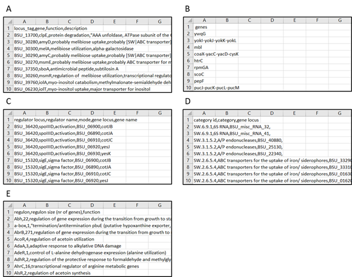{width="6.247222222222222in"
height="4.913888888888889in"}

Figure 2: Overview of input files. A) Gene info; B) Operons; C)
Regulons; D) Categories; E) Regulon info.

[3.3 Overview of input dataset]{.underline}

Datasets that are analyzed with GINtool are the result of a differential
expression analysis of your transcriptomics data. The file includes a
column with gene names, fold-changes and p-values (or a related
statistical classifier). Figure 3 shows an example. The fold-changes can
be log2 transformed, but do not have to. Importantly, a minus sign (-)
is required to indicate downregulation. Remove non-numerical values
(like "NA") for fold-change and p-values.

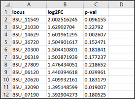{width="2.8534722222222224in"
height="2.1069444444444443in"}

Figure 3: Example of transcriptomics data. The data contains three
columns: a column containing gene IDs, a column with log2-transformed
fold-changes and a column with p-values.

**!** Gene IDs in the dataset need to match the gene IDs in the
reference files. For example, BSU11549 is not the same as BSU_11549.

**4. Preparing GINtool for analyses**

*First prepare the transcriptomics data and reference files according to
**section 3**.*

[4.1 First use: upload files]{.underline}

Open your transcriptomics data in Excel and open GINtool via the tab in
the toolbar (Figure 1A). Click "[show/hide settings]{.underline}" to
open the settings. Upload the reference files for gene info and the
analysis you want to perform (*i.e.*, operon, regulon or functional
categories) by clicking on the appropriate buttons and selecting the
files (Figure 4A). After uploading each file, link the column names to
the correct element ("[show/hide column mapping]{.underline}", Figure
1D).

In case of regulon information, also determine regulon directions
(Figure 4B). The left box called "[undefined]{.underline}" lists all
definitions found under the "[direction column]{.underline}" which is
labelled "[mode]{.underline}" in the example. For a complete regulon
analysis it is necessary to separate the different types of regulation
into activation and repression by moving them either into the
"[up-regulated]{.underline}" or "[down-regulated]{.underline}" boxes.
When the type of regulation is unknown it can be left in the "undefined"
box. Of note, we consider "[sigma factors]{.underline}" activators. This
information will be maintained in Excel for use in next sessions, as
long as you use the same regulon file (see 4.3).

**!** Gene info is mandatory for each analysis, in combination with at
least the reference files for either operons, regulons or categories.

[4.2 Select transcriptomics data]{.underline}

After uploading and mapping the reference data, hide the settings by
clicking "[show/hide settings]{.underline}". The "[select]{.underline}"
button should now be enabled. If not, click "[initialize
data]{.underline}". Click the "[select]{.underline}" button, select the
appropriate columns of your transcriptomics data (Figure 4C) and click
"OK". The analysis bar will now be enabled.

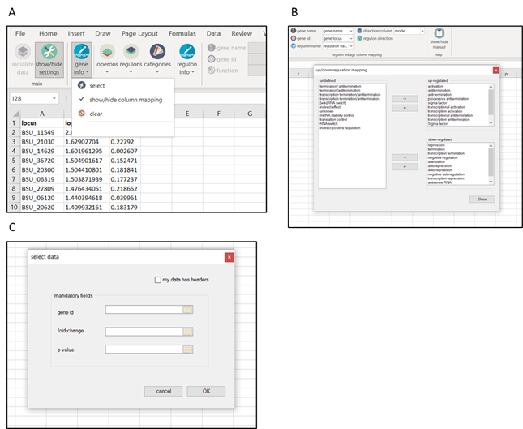{width="6.713888888888889in"
height="5.506944444444445in"}

Figure 4: Uploading reference files and selecting your data. A)
Selection of reference file for gene info; B) Up/down regulation mapping
of regulons; C) Selecting of columns of transcriptomics data.

[4.3 Subsequent use: continue using GINtool after closing
Excel]{.underline}

After restarting Excel, you may need to repeat some of the steps
described in 4.1 and 4.2. If the analysis buttons are disabled, you need
to select the data columns again. If this is not possible, check if the
reference files are still coupled by clicking on the arrow buttons
beneath the reference file buttons. If the files are still coupled,
click "[initialize data]{.underline}" button in order to reload the
files. If the files are not coupled, upload the files again, map the
correct columns and click "[initialize data]{.underline}". Now you are
again able to select your data and continue your analyses.

**5. Analysis of operons**

*First follow the steps described in **section 4**.*

[5.1 Fold-changes genes in operons]{.underline}

To calculate fold-changes in operons, tick "[use operons]{.underline}"
in the "[focus]{.underline}" window (Figure 5A, red box) and click
"[make tables]{.underline}" in the "[tables]{.underline}" window. This
will create a new sheet called "[Mapped]{.underline}" (Figure 5B). In
"[Mapped]{.underline}", each row represents the information for one
gene. Of note, the fold-changes in operon data begins in column K. To
make this more clear, we used the Excel option "[Conditional
formatting]{.underline}" to highlight fold-change differences using
colors. Column D shows the gene and column G the operon to which the
gene belongs. The structure of the operon is indicated in column J, and
column I shows the number of genes in the operon. Figure 5B, row 234,
gives a clear example of an operon that is not regulated like an operon,
since the two genes in the *yxaJ* operon shows very different
fold-changes. Sometimes there are different transcriptional start sites
in an operon, *e.g.*, this is shown in row 233 and 238 in Figure 5B. In
this case column H gives the value 2 for the number of operons. Cell
K236 is empty, because for some reason there is no proper fold-change
data for the gene *yfnH*.

In the example above, the tick box "[no filter]{.underline}" in the
window "[filter settings]{.underline}" is activated (Figure 5A), thus
all transcriptomics data is used in this analysis. If you wish to
prefilter genes, you can specify cut-off values for either the
fold-change or p-value of the genes that are included in the analysis.
Click "[show/hide settings]{.underline}" to open the settings bar. The
desired cut-offs can be determined in the cut-offs window (Figure 5C,
red box). By default, no cut-offs are activated. To use a cut-off, click
"[show/hide settings]{.underline}" and tick "[fold-changes]{.underline}"
in the "[filter settings]{.underline}" window in the analysis bar
(Figure 5D, red box). The table can be created as described above. For
example, the FC cut-off can be changed to 2. After filtering the genes
based on a fold-change cut-off of 2, only 32 operons remain (Figure 5E).
The same procedure can be followed to select genes based on p-values, or
to select based on both cut-offs, by ticking the appropriate boxes in
"[filter settings]{.underline}" (Figure 5D).

**!** If the fold-changes in the data set are log2 transformed, then the
FC cut-off is also interpreted as such.

**!** The fold-change cut-offs are absolute values, *i.e.*, fold 2 can
be both 2-fold downregulation and 2-fold upregulation.

{width="6.634027777777778in"
height="7.674305555555556in"}

Figure 5: Analysis of operons. A) Selection of operons as focus of the
analysis; B) Snapshot of "[Mapped]{.underline}". Fold-changes are
colored by conditional formatting; C) Cut-off settings; D) Activating
fold-change filter; E) Overview of "Mapped" after filtering based on a
fold-change of 2.

**6. Analysis of regulons**

*First follow the steps described in **section 4**.*

[6.1 Visual analysis of regulons using spread plots]{.underline}

GINtool gives the option to rank regulons based on the average
fold-change of all genes in a regulon. The distribution of fold-changes
of genes of regulons can be visualized in a spread plot. Start by
ticking "[use regulons]{.underline}" as "[focus]{.underline}" and
"[spreading]{.underline}" for "[plots]{.underline}" (Figure 6A). Click
"[make plots]{.underline}", the "[Select
categories/regulons]{.underline}" window will pop up (Figure 6B).

By clicking on "[Regulons]{.underline}" in the left window "[Available
categories/regulons]{.underline}", all regulons become visible. Regulons
can be selected and moved to the right window "[Selection]{.underline}"
by clicking on the single arrow button. It is also possible to select
all regulons by clicking the double arrow. To produce the spread plot,
click "[Ok]{.underline}". This will create a new sheet called
"[RegSpreadPlot]{.underline}", displaying the fold-changes of all genes
in the selected regulons. The regulons are ranked based on the average
fold-change (Figure 6C). The x-axis indicates the fold-change. In the
example all regulons were selected.

{width="4.680555555555555in"
height="6.760416666666667in"}

Figure 6: Creating a spread plot of all regulons. A) Selection of focus
and type of plot; B) Selection of regulons of interest; C) Spread plot
"[RegSpreadPlot]{.underline}" with information of fold-changes of all
genes in all regulons, in descending order.

Often only the most up- or downregulated regulons are interesting. To
show these, go back to "[make plots]{.underline}" and tick the "[top
FC]{.underline}" (fold-change) box and set the number of most strongly
regulated regulons to be displayed, *e.g.*, 20 (Figure 7A, red box). By
clicking on "[Ok]{.underline}" a new sheet is created called
"[RegSpreadPlotTop20FC]{.underline}", displaying the 20 most affected
regulons (Figure 7B). Alternatively, the regulons with the lowest
average p-values (see 10) can be selected (Figure 7A, red box).

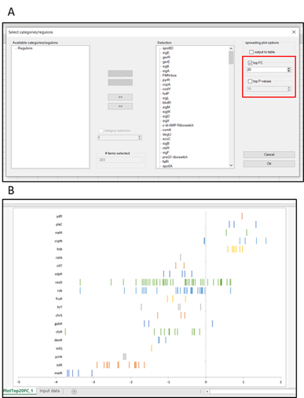{width="4.027083333333334in"
height="5.273611111111111in"}

Figure 7: Creating a spread plot of top 20 affected regulons based on
average fold-changes. A) Selection of spreading plot options; B) Plot of
top 20 most affected regulons based on average FC
"[RegSpreadPlotTop20FC]{.underline}".

As default the most upregulated regulons are displayed on top. This
order can be reversed. For this, click "[show/hide
settings]{.underline}" and the "[sort direction]{.underline}" window
becomes visible (Figure 8A, red box). Tick "[ascending]{.underline}",
click on "[show/hide settings]{.underline}" and "[make
plots]{.underline}", select the regulons of interest, if necessary also
select the best scoring regulons using the FC or p-value selection, and
click "[Ok]{.underline}". Figure 8B shows the reversed result of Figure
6C.

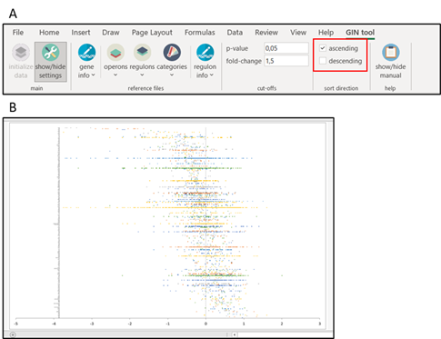{width="5.0472222222222225in"
height="3.8805555555555555in"}

Figure 8: Creating a spread plot of all regulons in ascending order. A)
In settings bar, ticking direction in "[sort direction]{.underline}"; B)
Spread plot "[RegSpreadPlot]{.underline}" with information of
fold-changes of all genes in all regulons, in ascending order.

It can be useful to know what genes are part of the selected regulons
and what their fold-change and p-values are. To obtain this information
click again on "[make plots]{.underline}" but this time tick the
"[output to table]{.underline}" box (Figure 9A, red box). In the example
the 10 strongest up or down regulated regulons have been selected. After
clicking "[Ok]{.underline}" a sheet called
"[RegSpreadTabTop10FC]{.underline}" is created, listing the selected
regulons with the genes that are part of the regulon and the related
fold-change (FC) (Figure 9B). Besides, a sheet with the corresponding
spread plot called "[RegSpreadPlotTop10FC]{.underline}" is created.

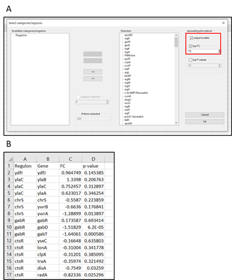{width="4.086805555555555in"
height="4.934027777777778in"}

Figure 9B: Generation of table with fold-change and p-value of genes in
selected regulons. A) Selection of settings in "[Select
categories/regulons]{.underline}"; B) Resulting table in sheet
"[RegSpreadTabTop10FC]{.underline}".

An alternative way to select regulons is by specifying cut-off values
for either the fold-change or p-value of the genes that are included in
the analysis. Click "[show/hide settings]{.underline}" to open the
settings bar. The desired cut-offs can be determined in the cut-offs
window (Figure 10A, red box). By default, no cut-offs are activated. To
use a cut-off, click "[show/hide settings]{.underline}" and tick
"[fold-changes]{.underline}" in the "[filter settings]{.underline}"
window in the analysis bar (Figure 10B, red box). The plots and tables
can be created as described above. For example, the FC cut-off can be
changed to 2. After filtering the genes based on a fold-change cut-off
of 2, only 14 regulons remain (Figure 10C). The same procedure can be
followed to select genes based on p-values, or to select based on both
cut-offs, by ticking the appropriate boxes in "[filter
settings]{.underline}" (Figure 10B).

**!** If the fold-changes in the data set are log2 transformed, then the
FC cut-off is also interpreted as such.

**!** The fold-change cut-offs are absolute values, *i.e.*, fold 2 can
be both 2-fold downregulation and 2-fold upregulation.

{width="5.180555555555555in"
height="5.080555555555556in"}

Figure 10: Creating spread plots of regulons after filtering genes. A)
Cut-off values can be specified in the "[cut-offs]{.underline}" window
in the settings bar; B) Cut-offs can be activated by ticking the
appropriate boxes in "[filter settings]{.underline}" in the analysis
bar; C) Example of "[RegSpreadPlot]{.underline}" after filtering genes
below a fold-change of 2.

[6.2 Visual analysis of regulons using bubble plots]{.underline}

The large number of regulons can make it difficult to visually determine
how relevant they are. To facilitate this, GINtool can make bubble plots
based on the average fold-change of the genes in a regulon (x-axis) and
the spreading of fold-changes of genes, defined as the mean absolute
deviation (MAD, see 10) of the fold-changes (y-axis). Regulons that show
a robust regulation should have fold-changes that are close together,
resulting in lower MAD values.

To make these bubble plots, tick "[use regulons]{.underline}" in the
"[focus]{.underline}" window and "[ranking]{.underline}" in the
"[plots]{.underline}" window (Figure 11A, red boxes). Click "[make
plots]{.underline}" and the "[select categories/regulons]{.underline}"
window will pop up. Select the relevant regulons as described above
(section 6.1). Of note, for this analysis it is not possible to select
regulons with e.g. highest fold-change or lowest average p-value,
however, fold-change and p-value cut-offs for genes can be activated
(Figure 10A). In the example below, no filters are active and all
regulons are selected.

After selecting regulons and clicking "[Ok]{.underline}", four sheets
are created: "[RegRankPlot]{.underline}",
"[RegRankPlotBest_v1]{.underline}", "[RegRankPlotBest_v2]{.underline}"
and "[RegRankTable]{.underline}". "[RegRankPlotBest_v1]{.underline}" and
"[RegRankPlotBest_v2]{.underline}" will be discussed in section 6.4. An
example of "[RegRankPlot]{.underline}" is shown in Figure 11B.

{width="5.173611111111111in"
height="4.027083333333334in"}

Figure 11: Creating a bubble plot of the average regulation of all
regulons. A) Selection of correct settings for creating bubble plots of
regulons; B) Example bubble plot "[RegRankPlot]{.underline}" of all
regulons. Color intensity corresponds to average p-value. Bubble size
corresponds to number of genes in regulon.

The use of a bubble plot provides the possibility to also display the
size of regulons, *i.e.* the number of genes that are part of a regulon.
The example in Figure 11B displays bubbles with different color
intensities. The color intensity is related to the average p-value of
the genes in the regulon. Regulons with lower average p-values, *i.e.*
with more reliable fold-changes, have a more intense color.

The average p-values are distributed in five different classes: average
p-value \>= 0.5, between 0.5-0.25, between 0.25-0.125, between
0.125-0.0625, and \< 0.0625. The classification enables the removal of
regulons with high average p-values. Regulons with high p-values can be
removed by using the Excel "[Chart filter]{.underline}" tool that is
activated by clicking on the graph (Figure 12A). In the example in
Figure 12A, the regulons with average p-values of \>= 0.5 are removed.
The bubbles are larger, because Excel works with relative measures for
bubble scaling. The scale can be adjusted using the "[Format data
series]{.underline}" tool that becomes available by right-clicking on a
bubble (Figure 12B). In this example, the scale is reduced to 50. Of
course, the plots can be converted in other type of graphs and adjusted
using standard Excel tools, and the graphs can be exported for furter
editing, which can be useful to reposition the names of bubbles or
change the size or colors.

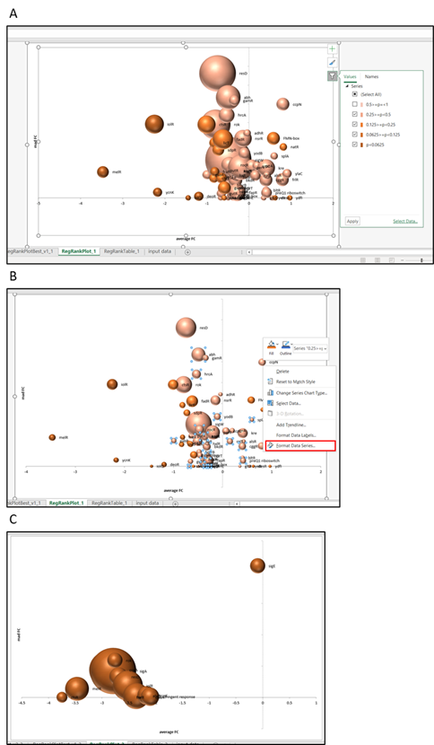{width="5.040277777777778in"
height="8.640972222222222in"}

Figure 12: Creating bubble plots of regulons based on preferences. A)
Selecting bubbles based on average p-value of genes in a regulon; B)
Rescaling bubble sizes; C) Bubble plot of regulons after filtering genes
with FC cut-off of 2.

It is possible display the bubble plots of regulons after filtering the
genes in the regulons based on fold-change and p-value (Section 6.1,
Figure 10A). When a fold-change cut-off of 2 is active, fewer regulons
remain and the bubbles are darker in color, since the average p-values
are much lower with this stringent fold-change cut-off value (Figure
12C).

[6.3 Regulon evaluation using tables]{.underline}

The average fold-change, MAD- and p-values can also be listed in a
table. To do this, click on the "[make tables]{.underline}" tab in the
"[tables]{.underline}" window (Figure 13A, red box). This creates two
sheets: "[Mapping_details]{.underline}" and "[Mapped]{.underline}".
"[Mapped]{.underline}" will be discussed in section 6.4. The
"[Mapping_details]{.underline}" sheet contains four different tables
(Figure 13B). The first table "[Without regulatory
directionality]{.underline}" shows the number of genes, average
fold-change, MAD fold-change and average p-value for each regulon. The
table enables a quick ranking according to any of these parameters, by
selecting the headers and using the Excel option "[Filter]{.underline}"
in the "[Sort & Filter]{.underline}" tab in the Home tab (Figure 13C,
red box).

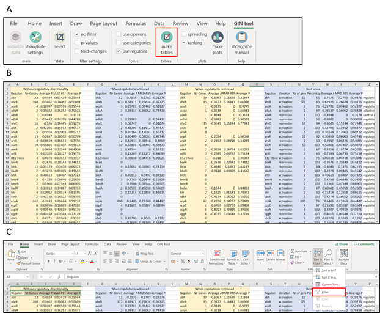{width="6.480555555555555in"
height="5.334027777777778in"}

Figure 13: Creating tables with regulon information. A) Selecting the
right options for creating tables; B) Sheet
"[Mapping_details]{.underline}"; C) Adding filters to headers to enable
filtering and sorting of the first table.

[6.4 Determination of most relevant regulon regulation]{.underline}

The problem with ranking of regulons is that the average fold-change
calculation is based on all the genes of a regulon. However, a regulator
might repress certain genes and activate others. This heterogeneity will
reduce the average fold-change. For example, when a regulator
significantly activates 5 genes and represses 5 genes then the average
fold-change can be close to zero, whereas the regulator/regulon is
significantly activated. To correct for this, GINtool uses the
regulation direction that has been defined when uploading the regulon
file in the "[up/down regulation mapping]{.underline}" window discussed
in section 4.1 (Figure 4B). This information indicates whether a
regulator activates or represses a gene. To incorporate this
information, GINtool calculates the situation when the regulator is
either activated or repressed, resulting in the second and third table
in "[Mapping_details]{.underline}" that are labelled "[When regulator is
activated]{.underline}" and "[When regulator is repressed]{.underline}".
The fourth, most right, table called "[Best score]{.underline}", lists
the best scoring activity from the second and third tables, based
firstly on the number of genes that follow the same type of activity,
and in case the numbers are the same, based on the activity with the
highest average FC. This final table also indicates the fraction of
genes that follow the most relevant regulon activity relative to all the
genes that belong to a regulon, indicated in % in column V.

The result of the "[Best score]{.underline}" table is automatically
displayed as bubble plot when the GINtool option "[make
plots]{.underline}" is used and the tick box "[ranking]{.underline}" is
active (see section 6.2). This plot is called
"[RegRankPlotBest_v1]{.underline}" (Figure 14A). In this plot the
negative or positive fold-change indicate whether a regulator is
activated or repressed, respectively. *Importantly*(!), this can be a
different direction than the measured fold-changes, since an activated
repressor (positive FC in the plot) will reduce the expression of genes.
That is why in the example below the repressor encoding *melR* has a
positive value whereas the average fold-change of the MelR regulon was
negative as shown in the "[RegRankPlot]{.underline}" bubble plot in
Figure 11B.

The problem with "[RegRankPlotBest_v1]{.underline}" is that it is
unclear how many genes of a regulon (columns H and N versus column B in
the "[Mapping_details]{.underline}" sheet) form the bubble data points.
However, the fourth "[Best score]{.underline}" table also provides the
fraction of the genes that were selected, % in column V, which provides
an alternative way to display the most relevant regulons for a quick
visual inspection by plotting the average fold-change of the best
scoring activity against the fraction (%) of genes in a regulon that are
responsible for the calculated fold-change. Such bubble plot is
automatically made when the GINtool option "[make plots]{.underline}" is
used and the tick box "[ranking]{.underline}" is on, and is called
"[RegRankPlotBest_v2]{.underline}" (Figure 14B). In the example, the
bubble size has been reduced and regulons with average p-values \>= 0.5
are not shown. Since only the most relevant activity of the regulons are
chosen for the \"[Best score]{.underline}\" table, the fraction is
always above 50 %. Finally, also for this graph type, bubble size and
names can be adjusted using standard Excel tools, and the most relevant
regulons can also be selected by setting cut-off values in the "[filter
settings]{.underline}" window as explained in 6.2.

{width="3.8270833333333334in"
height="5.540277777777778in"}

Figure 14: Bubble plots of most relevant regulon activities. A)
"RegRankPlotBest_v1" shows the most relevant regulation of each regulon;
B) "RegRankPlotBest_v2" shows the fraction of genes that follows the
most relevant regulon regulation. Regulons with p-values \>= 0.5 are
filtered and bubbles are rescaled to 50.

It can be useful to have the "[Best score]{.underline}" data of regulons
available for every gene. This is possible by using the "[make
tables]{.underline}" function in GINtool. As described at the beginning
of this section, this function produces two table sheets among which one
is called "[Mapped]{.underline}" (Figure 15).

The table indicates the details of a gene (ID, name, fold-change,
p-value, function, description), the number of regulons ("[Tot#
Regulons]{.underline}"), and names of the regulons to which the gene
belongs. In addition, it shows in between brackets the average
fold-change (FC) and fraction (%) of genes of the most relevant state of
a regulon based on the "[Best score]{.underline}" table in the table
sheet "[Mapping_details]{.underline}" (e.g., sigE(FC:0.44 71%)).

{width="6.373611111111111in"
height="2.7333333333333334in"}

Figure 15: Overview of the table in sheet named "[Mapped]{.underline}".
Regulon information is shown per gene.

**7. Analysis of functional categories**

*First follow the steps described in **section 4**.*

[7.1 Visual analysis of functional categories using spread
plots]{.underline}

GINtool gives the option to rank functional categories based on the
average fold-change of all genes in a functional category. The
distribution of fold-changes of genes of functional categories can be
visualized in a spread plot. Start by ticking "[use
categories]{.underline}" as "[focus]{.underline}" and
"[spreading]{.underline}" for "[plots]{.underline}" (Figure 16A). Click
"[make plots]{.underline}", the "[Select
categories/regulons]{.underline}" window will pop up (Figure 16B).

By clicking on "[Categories]{.underline}" in the left window "[Available
categories/regulons]{.underline}", the subcategories become visible.
Categories and subcategories can be selected and moved to the right
window "[Selection]{.underline}" by clicking on the single arrow button.
It is also possible to select different levels of categories by ticking
the "[category selection]{.underline}" box, indicating the level you
would like to display and subsequently clicking the double arrow button
(Figure 16B, red box). The most detailed categories, are levels III and
IV for the *B. subtilis* annotation. To produce the spread plot, click
"[Ok]{.underline}". This will create a new sheet called
"[CatSpreadPlot]{.underline}", displaying the fold-changes of all genes
in the selected categories, whereby the categories are ranked based on
the average fold-change (Figure 6C). The x-axis indicates the
fold-change.

{width="4.680555555555555in"
height="6.180555555555555in"}

Figure 16: Creating a spread plot of functional categories. A) Selection
of focus and type of plot; B) Selection of categories of interest; C)
Spread plot "[CatSpreadPlot]{.underline}" with information of
fold-changes of all genes in the selected categories, in descending
order.

Often only the most up- or down-regulated categories are interesting. To
show these, go back to "[make plots]{.underline}" and tick the "[top
FC]{.underline}" (fold-change) box and set the number of most strongly
regulated categories to be displayed, *e.g.*, 20 (Figure 17A, red box).
By clicking on "[Ok]{.underline}" a new sheet is created called
"[CatSpreadPlotTop20FC]{.underline}", displaying the 20 most affected
selected categories (Figure 17B). Alternatively, the categories with the
lowest average P-values can be selected (Figure 17A, red box).

{width="4.067361111111111in"
height="5.160416666666666in"}

Figure 17: Creating a spread plot of top 20 affected categories based on
average fold-changes. A) Selection of spreading plot options; B) Plot of
top 20 most affected selected categories based on average FC
"[CatSpreadPlotTop20FC]{.underline}".

As default the most upregulated categories are displayed on top. This
order can be reversed. For this, click on the "[show/hide
settings]{.underline}" tab so that the "[sort direction]{.underline}"
window becomes visible (Figure 18A, red box). Tick
"[ascending]{.underline}", click on "[show/hide settings]{.underline}"
and "[make plots]{.underline}", select the categories of interest, if
necessary also select the best scoring categories using the FC or
p-value selection, and click on "[Ok]{.underline}". Figure 18B shows the
reversed result of Figure 16C.

{width="5.060416666666667in"
height="3.8666666666666667in"}

Figure 18: Creating a spread plot of all selected categories in
ascending order. A) In settings bar, tick direction in "[sort
direction]{.underline}"; B) Spread plot "[CatSpreadPlot]{.underline}"
with information of fold-changes of all genes in the selected
categories, in ascending order.

It can be useful to know what genes are part of the selected categories
and what their fold-change and p-values are. To obtain this information
click again on "[make plots]{.underline}" but this time tick the
"[output to table]{.underline}" box (Figure 19A, red box). In the
example the 10 strongest up- or down regulated categories have been
selected. After clicking "[Ok]{.underline}" a sheet called
"[CatSpreadTabTop10FC]{.underline}" is created, listing the selected
categories with the genes that are part of the category and the related
fold-change (FC) (Figure 19B). Besides, a sheet with the corresponding
spread plot called "[CatSpreadPlotTop10FC]{.underline}" is created.

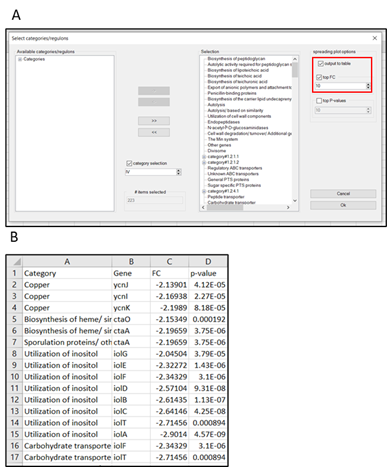{width="4.027083333333334in"
height="4.867361111111111in"}

Figure 19B: Generation of table with fold-change and p-value of genes in
selected categories. A) Selection of settings in "[Select
categories/regulons]{.underline}"; B) Resulting table in sheet
"[CatSpreadTabTop10FC]{.underline}".

An alternative way to select categories is by specifying cut-off values
for either the fold-change or p-value of the genes that are included in
the analysis. Click "[show/hide settings]{.underline}" to open the
settings bar. The desired cut-offs can be determined in the cut-offs
window (Figure 20A, red box). By default, no cut-offs are activated. To
use a cut-off, click "[show/hide settings]{.underline}" and tick
"[fold-changes]{.underline}" in the "[filter settings]{.underline}"
window in the analysis bar (Figure 20B, red box). The plots and tables
can be created as described above. For example, the FC cut-off can be
changed to 2. After filtering the genes based on a fold-change cut-off
of 2, only 14 categories remain (Figure 20C). The same procedure can be
followed to select genes based on p-values, or to select based on both
cut-offs, by ticking the appropriate boxes in "[filter
settings]{.underline}" (Figure 20B).

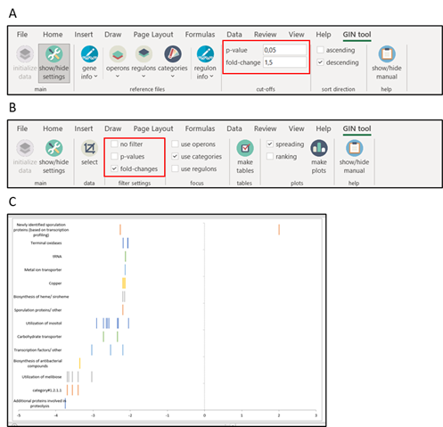{width="5.180555555555555in"
height="4.986805555555556in"}

Figure 20: Creating a spread plots of categories after filtering genes.
A) Cut-off values can be specified in the "[cut-offs]{.underline}"
window in the settings bar; B) Cut-offs can be activated by ticking the
appropriate boxes in "[filter settings]{.underline}" in the analysis
bar; C) Example of "[CatSpreadPlot]{.underline}" after filtering genes
below a fold-change of 2.

**!** If the fold-changes in the data set are log2 transformed, then the
FC cut-off is also interpreted as such.

**!** The fold-change cut-offs are absolute values, *i.e.*, fold 2 can
be both 2-fold downregulation and 2-fold upregulation.

[7.2 Visual analysis of functional categories using bubble
plots]{.underline}

The large number of categories can make it difficult to visually
determine how relevant they are. To facilitate this, GINtool can make
bubble plots based on the average fold-change of the genes in a category
(x-axis) and the spreading of fold-changes of genes, defined as the mean
absolute deviation (MAD) of the fold-changes (y-axis). Categories that
show a robust regulation should have fold-changes that are close
together, resulting in lower MAD values.

To make these bubble plots, tick "[use categories]{.underline}" in the
"[focus]{.underline}" window and "[ranking]{.underline}" in the
"[plots]{.underline}" window (Figure 21A, red boxes). Click "[make
plots]{.underline}" and the "[select categories/regulons]{.underline}"
window will pop up. Select the relevant categories as described above
(section 7.1). Of note, for this analysis it is not possible to select
categories with the highest fold-change or lowest average p-value, but
filters for genes can be activated (Figure 20A). In this example, no
filters are active and the IV^th^ category level is selected.

After selecting categories and clicking "[Ok]{.underline}", four sheets
are created: "[CatRankPlot]{.underline}",
"[CatRankPlotBest_v1]{.underline}", "[CatRankPlotBest_v2]{.underline}"
and "[CatRankTable]{.underline}". "[CatRankTable]{.underline}" is the
same table as "[Mapping_details]{.underline}" which will be discussed in
section 7.3, "[CatRankPlotBest_v1]{.underline}" and
"[CatRankPlotBest_v2]{.underline}" will be discussed in section 7.4. An
example of "[CatRankPlot]{.underline}" is shown in Figure 21B.

{width="5.173611111111111in"
height="3.8604166666666666in"}

Figure 21: Creating a bubble plot of the average regulation of all
selected categories. A) Selection of correct settings for creating
bubble plots of categories; B) Example bubble plot
"[CatRankPlot]{.underline}" of all included categories and genes. Color
intensity corresponds to average p-value. Bubble size corresponds to
number of genes in regulon.

The use of a bubble plot provides the possibility to also display the
size of categories, *i.e.*, the number of genes of a category. The
example in Figure 21B displays bubbles with different color intensities.
The color intensity is related to the average p-value of the genes in
the category. Categories with lower average p-values, *i.e.*, with more
reliable fold-changes, have a more intense color.

The average p-values are distributed in five different classes: average
p-value \>= 0.5, between 0.5-0.25, between 0.25-0.125, between
0.125-0.0625, and \< 0.0625. The classification enables the removal of
categories with high average p-values. Categories with high p-values can
be removed by using the Excel "[Chart filter]{.underline}" tool that is
activated by clicking on the graph (Figure 22A). In the example in
Figure 22A, the categories with average p-values of \>= 0.5 are removed.
The bubbles are larger, because Excel works with relative measures for
bubble scaling. The scale can be adjusted using the "[Format data
series]{.underline}" tool that becomes available by right-clicking on a
bubble (Figure 22B). In this example, the scale is reduced to 50. Of
course, the plots can be converted and adjusted using other standard
Excel tools, and the graphs can be exported for furter editing, which
can be useful to reposition the names of bubbles or change the colors.

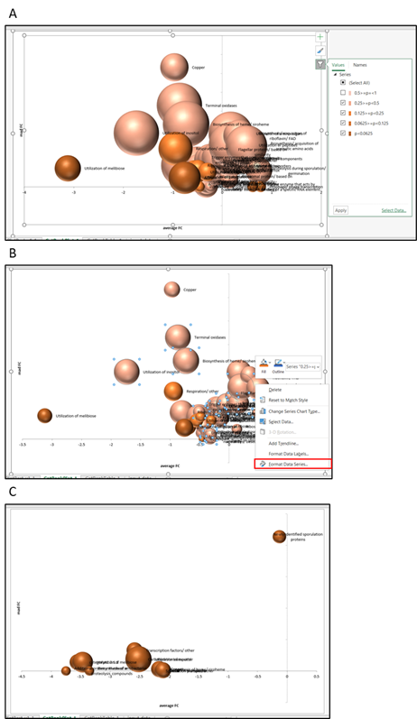{width="4.813888888888889in"
height="8.300694444444444in"}

Figure 22: Creating bubble plots of categories based on preferences. A)
Selecting bubbles based on average p-value of genes in a category; B)
Rescaling bubble sizes; C) Bubble plot of categories after filtering
genes with FC cut-off of 2.

It is possible to display the bubble plots of categories after filtering
the genes in the categories based on fold-change and p-value (Section
7.1, Figure 20A). When a fold-change cut-off of 2 is active, fewer
categories remain and the bubbles are darker in color, since the average
p-values are much lower with this stringent fold-change cut-off value
(Figure 22C).

[7.3 Functional category evaluation using tables]{.underline}

The average fold-change, MAD- and p-values can also be listed in a
table. To do this, click on the "[make tables]{.underline}" tab in the
"[tables]{.underline}" window (Figure 23A, red box). This creates two
sheets: "[Mapping_details]{.underline}" and "[Mapped]{.underline}".
"[Mapped]{.underline}" will be discussed in section 7.4. The
"[Mapping_details]{.underline}" sheet contains four different tables
(Figure 23B). The first table "[Plot data]{.underline}" shows the number
of genes, average fold-change, MAD fold-change and average p-value for
each regulon. The table enables a quick ranking according to any of
these parameters, by selecting the headers and using the Excel option
"[Filter]{.underline}" in the "[Sort & Filter]{.underline}" tab in the
Home tab (Figure 23C, red box).

{width="6.627083333333333in"
height="5.660416666666666in"}

Figure 23: Creating tables with functional category information. A)
Selecting the right options for creating tables; B) Sheet
"[Mapping_details]{.underline}"; C) Adding filters to headers to enable
filtering and sorting of the first table.

[7.4 Determination of most relevant functional category
regulation]{.underline}

The problem with ranking of categories is that the average fold-change
calculation is based on all the genes of a category. However, it is
possible that some genes are activated whereas others are repressed. If
this heterogeneity is the case, then the related category is less
relevant. To identify categories that show the most consistent
activation or repression, GINtool can calculate the number of genes of a
category that corresponds to either activation or repression of the
category. This is automatically performed when "Mapping_details" is
created (see section 7.3). This is reflected in the second and third
table in "[Mapping_details]{.underline}" that are labelled "[Positive
Fc]{.underline}" and "[Negative Fc]{.underline}". The fourth, most right
table called "[Best results]{.underline}", lists the best scoring
activity of the categories from the second and third tables, based
firstly on the number of genes that follow the same type of activity,
and in case the numbers are the same, based on the activity with the
highest average FC. This final table also indicates the fraction of
genes that follow the most relevant category activity relative to all
the genes that belong to the category, indicated in % in column V.

The result of the "[Best results]{.underline}" table is automatically
displayed as bubble plot when the GINtool option "[make
plots]{.underline}" is used and the tick box "[ranking]{.underline}" is
active (see section 7.2). This plot is called
"[CatRankPlotBest_v1]{.underline}" (Figure 24A).

The problem with "[CatRankPlotBest_v1]{.underline}" is that it is
unclear how many genes of a category (columns H and N versus column B in
the "[Mapping_details]{.underline}" sheet) form the bubble data points.
However, the fourth "[Best results]{.underline}" table also provides the
fraction of the genes that were selected, % in column V, which provides
an alternative way to display the most relevant categories for a quick
visual inspection by plotting the average fold-change of the best
scoring activity against the fraction (%) of genes in a category that
are responsible for the calculated fold-change. Such bubble plot is
automatically made when the GINtool option "[make plots]{.underline}" is
used and the tick box "[ranking]{.underline}" is on, and is called
"[CatRankPlotBest_v2]{.underline}" (Figure 24B). In the example, the
bubble size has been reduced and categories with average p-values \>=
0.5 are not shown. Since only the most relevant activity of the
categories are chosen, the fraction is always above 50 %. Finally, also
for this graph type, bubble size and names can be adjusted using
standard Excel tools, and the most relevant categories can also be
selected by setting cut-off values in the "[filter
settings]{.underline}" window as explained in 7.2.

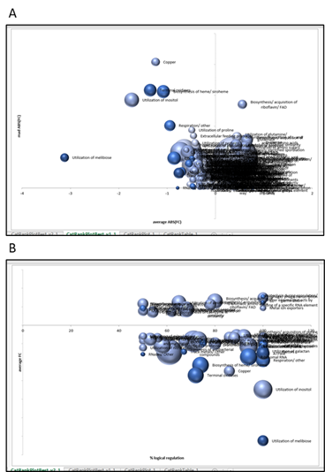{width="3.8333333333333335in"
height="5.560416666666667in"}

Figure 24: Bubble plots of most relevant category activities. A)
"CatRankPlotBest_v1" shows the most relevant regulation of each selected
category; B) "CatRankPlotBest_v2" shows the fraction of genes that
follows the most relevant category regulation. Categories with p-values
\>= 0.5 are filtered and bubbles are rescaled to 50.

It can be useful to have the "[Best results]{.underline}" data of
categories available for every gene. This is possible by using the
"[make tables]{.underline}" function in GINtool. As described at the
beginning of this section, this function produces two table sheets among
which one called "[Mapped]{.underline}" (Figure 25).

The table indicates the details of a gene (ID, name, fold-change,
p-value, function, description), the number of categories ("[Tot#
Categories]{.underline}"), and names of the categories to which the gene
belongs. In addition, it shows in between brackets the average
fold-change (FC) and fraction (%) of genes of the most relevant state of
a category based on the "[Best results]{.underline}" table in the table
sheet "[Mapping_details]{.underline}" (e.g., SP-beta prophage(FC:0.48
54%)).

{width="6.554166666666666in"
height="2.8472222222222223in"}

Figure 25: Overview of the table in sheet named "[Mapped]{.underline}".
Category information is shown per gene.

**8. Overview of output sheets**

[8.1 Operons]{.underline}

Make tables:

-   Mapped: for all genes, the fold-changes of the genes in its
    respective operon.

[8.2 Regulons]{.underline}

Spread plots:

-   RegSpreadPlot: plot of fold-changes of all included genes in the
    analyzed regulons.

-   RegSpreadTab: table of fold-changes of all included genes in the
    analyzed regulons.

-   RegSpreadPlotTopnFC: plot of fold-changes of all included genes in
    the top n regulons based on average FC.

-   RegSpreakPlotTopnP: plot of fold-changes of all included genes in
    the top n regulons based on average p-value.

-   RegSpreadTabTopnFC: table of fold-changes of all included genes in
    the top n regulons based on average FC.

-   RegSpreadTabnP: table of fold-changes of all included genes in the
    top n regulons based on average p-value.

Bubble plots:

-   RegRankPlot: bubbleplot of all selected regulons.

-   RegRankPlotBest_v1: bubbleplot of most relevant regulon activity of
    all selected regulons.

-   RegRankPlotBest_v2: bubbleplot of fraction of genes that follow most
    relevant regulon activity of all selected regulons.

-   RegRankTable: Mapping_details (see "make tables") but only for the
    genes that are included in the analysis.

Tables:

-   Mapped: overview of regulon information for each gene. For each
    regulon, the average fold-change of genes following most relevant
    regulon activity and fraction of genes that follow this activity are
    shown.

-   Mapping_details: tables showing 1) regulon details without
    regularity; 2) regulon details when regulator is repressed; 3)
    regulon details when regulator is activated; 4) best scoring regulon
    activity.

[8.3 Categories]{.underline}

Spread plots:

-   CatSpreadPlot: plot of fold-changes of all included genes in the
    analyzed categories.

-   CatSpreadTab: table of fold-changes of all included genes in the
    analyzed categories.

-   CatSpreadPlotTopnFC: plot of fold-changes of all included genes in
    the top n categories based on average FC.

-   CatSpreakPlotTopnP: plot of fold-changes of all included genes in
    the top n categories based on average p-value.

-   CatSpreadTabTopnFC: table of fold-changes of all included genes in
    the top n categories based on average FC.

-   CatSpreadTab10nP: table of fold-changes of all included genes in the
    top n categories based on average p-value.

Bubble plots:

-   CatRankPlot: bubbleplot of all selected categories.

-   CatRankPlotBest_v1: bubbleplot of most relevant category activity of
    all selected categories.

-   CatRankPlotBest_v2: bubbleplot of fraction of genes that follow most
    relevant category activity of all selected categories.

-   CatRankTable: Mapping_details (see "make tables") but only for the
    genes that are included in the analysis.

Tables:

-   Mapped: overview of category information for each gene. For each
    category, the average fold-change of genes following most relevant
    category activity and fraction of genes that follow this activity
    are shown.

-   Mapping_details: tables showing 1) Category details without
    regulation; 2) Category details when genes are upregulated; 3)
    Category details when genes are downregulated; 4) best scoring
    Category activity.

**9. Other ways to use GINtool data**

[9.1 Volcano plot display]{.underline}

A popular way to display transcriptome data is by means of a Volcano
plot where the p-value (X-axis) of genes is plotted against the fold
change (Y-axis). Using the average fold-change and p-values in the
tables in the \"[Mapped]{.underline}\" sheet, Volcano plots can be
generated for both regulons as well as functional categories.

[9.2 Comparing different experiments]{.underline}

The calculated average fold-change values for regulons in the
\"[Mapped]{.underline}\" sheet can be used as a convenient way to
compare transcriptome data between different experiments by, e.g., using
a scatter plot displaying the average fold-change value for a regulon
from one experiment against the average fold-change found in the other
experiment.

**10. Calculations**

[10.1 Median and Median absolute deviation (MAD)]{.underline}

As a robust measure, instead of the mean and standard deviation, the
median and median absolute deviation (MAD) are used. The median is less
prone to outliers and returns the 'middle' value of the observed values
after sorting (from low to high). The MAD is a robust approximation of
the spread around the median value and is calculated as the median of
the residuals with respect to the median value determined earlier.

[10.2 Average p-values]{.underline}

The p-values do not follow a normal distribution and they first have to
be transformed using a Fisher-Z transformation into z-values. The
average of these z-values is then back-transformed resulting in the
average p-value.
